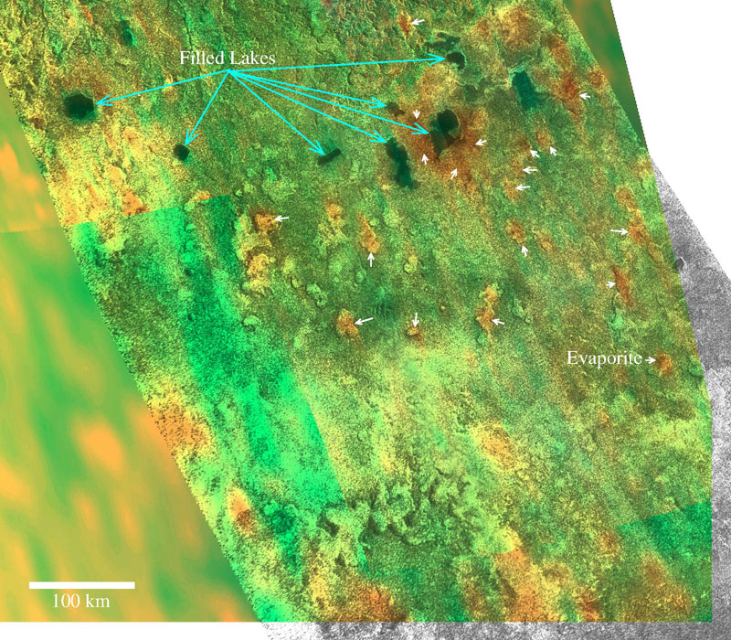
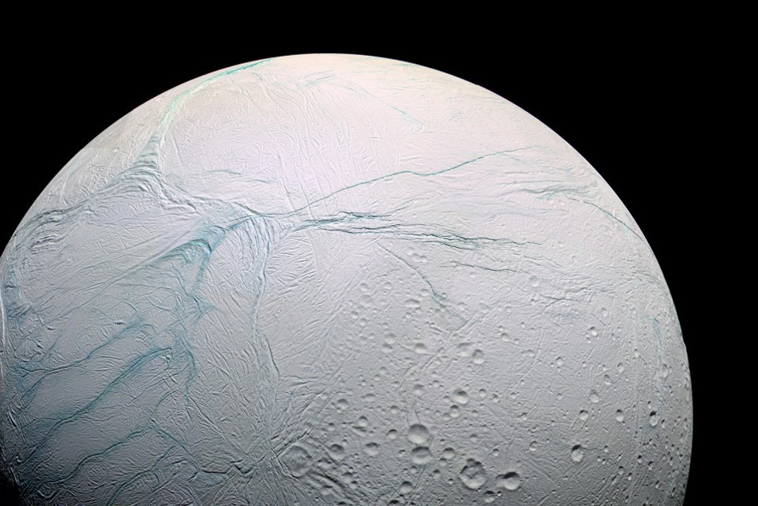
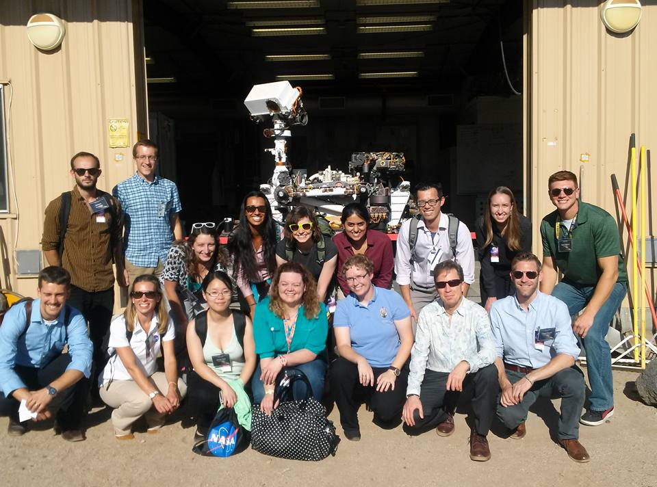
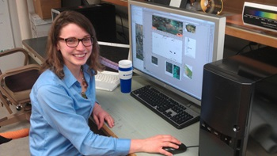
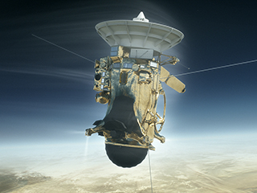

<html>
<head>

</head>
<body>

  
  
 'Bathtub rings suggest Titan's dynamic seas' by Nola Taylor Redd here

  
  
Exploring the Oceans of the Outer Solar System by Rebecca Boyle

  
  
'Concept Mission Suggests "Tasting" Moon of Saturn to Search for Life' by Tara Roberts

  
  
'Investigating a Distant World' by Tara Roberts

  
  
'What Cassini Can Teach Us' by Tara Roberts

</body>
</html>
